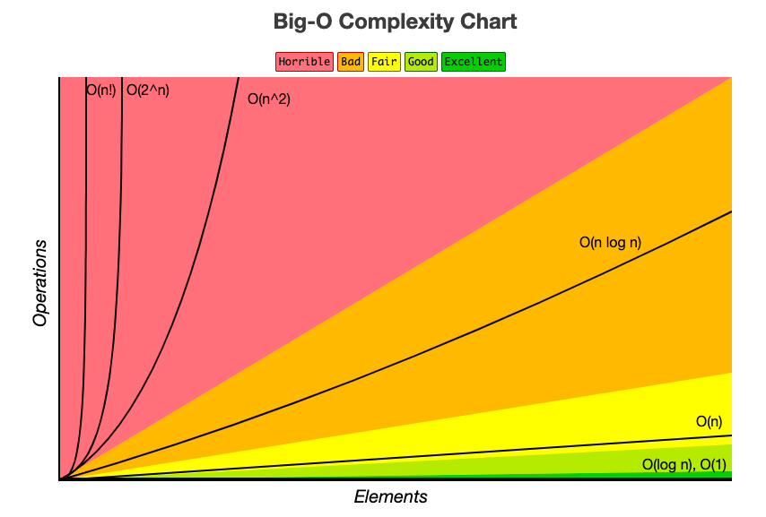

### 시간 복잡도(Time Complexity)

---
- 알고리즘이 실행될 때 필요한 '입력값' 과 '연산 수행시간' 에 따라 얼마나 효율적인 알고리즘인지 나타냄
- 입력값이 커질수록 알고리즘의 수행 시간이 어떻게 증가하는지에 따른 지표
- 시간 복잡도는 '빅오 표기법(Big-O notation)' 을 통해 표현하며 수치가 작을수록 효율적인 알고리즘을 의미함

