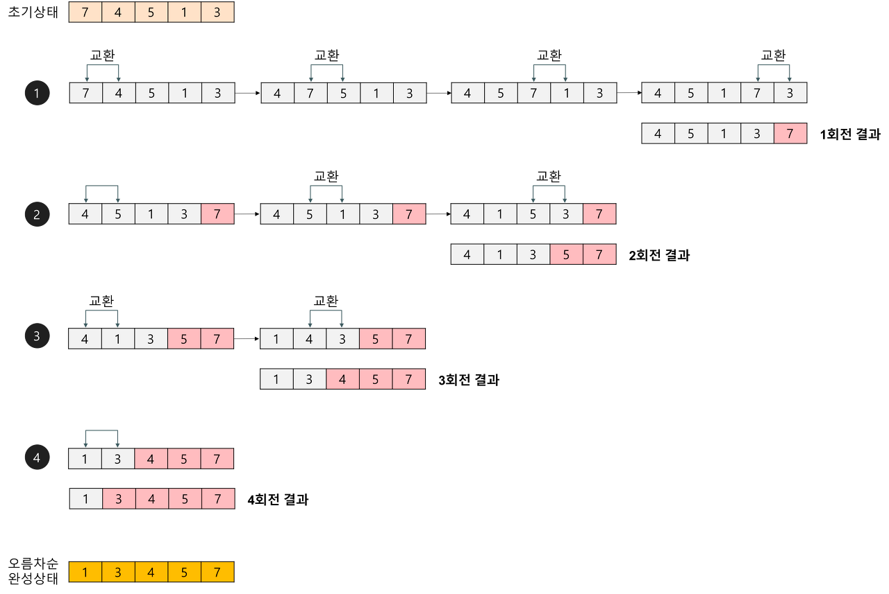

### 버블정렬

---

- 인접한 두 원소를 비교해 필요한 경우 위치를 교환해 배열을 정렬하는 방식.
- 해당 정렬 방식은 정렬할 원소의 개수가 적ㅇ르 때나, 정렬한 원소의 개수가 많더라도 이미 거의 정렬된 상태일 때 사용
- 대부분의 경우 다른 정렬 알고리즘들보다 느리고 비효율적이라 실제 사용되진 않음.
- 평균 시간복잡도 = O(n^2)
- 최악 시간 복잡도 = O(n^2)

### 동작방식

---
1. 배열의 첫번째 요소부터 인접한 요소와 비교.
2. 만약 인접한 요소의 순서가 잘못되어 있다면 위치를 교환.
3. 배열의 끝까지 이동하면서 위 과정을 반복함.
4. 한번의 반복이 끝나면 가장 큰 요소가 배열의 마지막으로 이동.
5. 위 과정을 배열이 정렬될 대까지 반복함.

---

