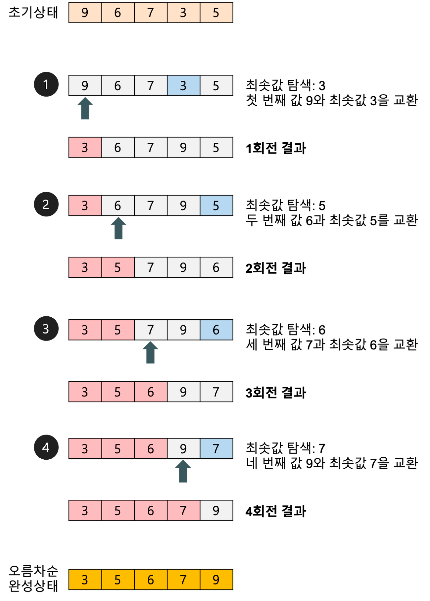

### 선택 정렬(selection sort)

---

- 주어진 배열에서 최초값을 찾아서 맨 앞의 원소와 자리를 바꾸고, 그 다음으로 작은 값을 찾아서 두번째 원소와 자리를 바꾸는 식으로 정렬하는 알고리즘
- 정렬할 원소의 개수가 적을 때나 이미 거의 정렬된 상태일 때 사용될 수 있음.
- 대부분의 경우 다른 정렬 알고리즘들보다 느리고 비효율적이기 때문에 실제 사용되는 경우는 드뭄.

### 동작방식

---

1. 배열에서 가장 작은 요소(최소값)를 찾는다.
2. 가장 작은 요소와 배열의 첫 번째 요소를 교환한다.
3. 두번째로 작은 요소를 찾아 두번째 요소와 교환
4. 이러한 과정을 배열의 끝까지 반복함.

---

